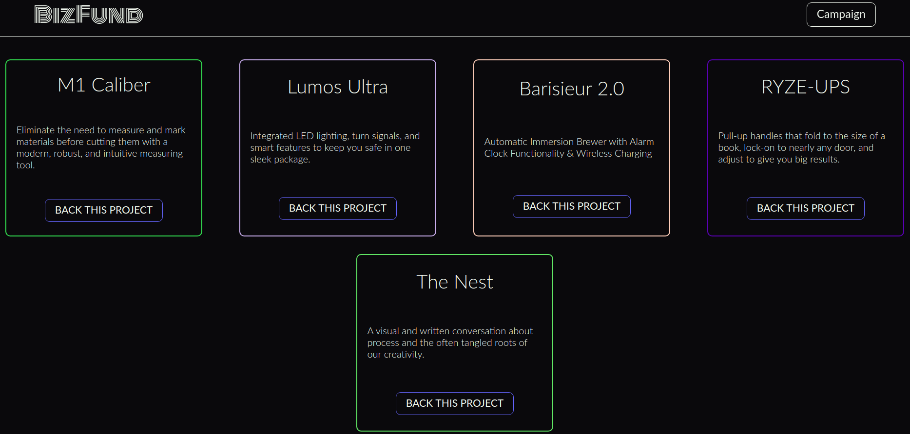
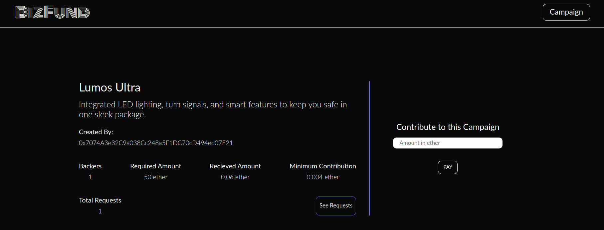
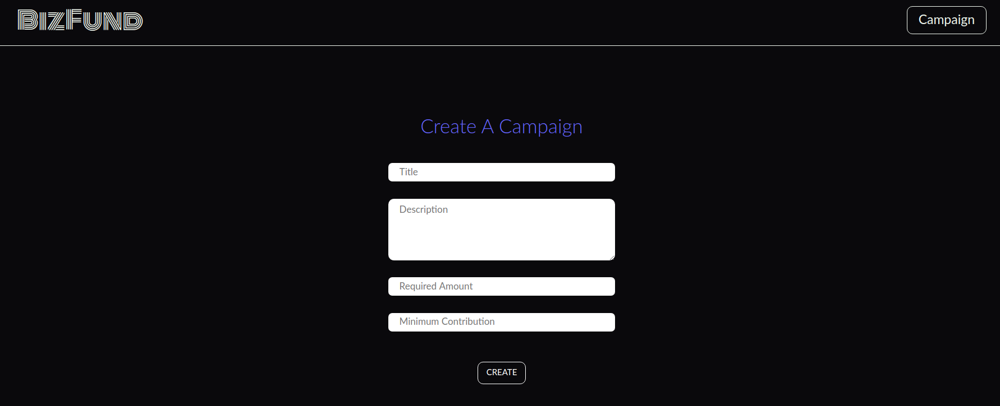
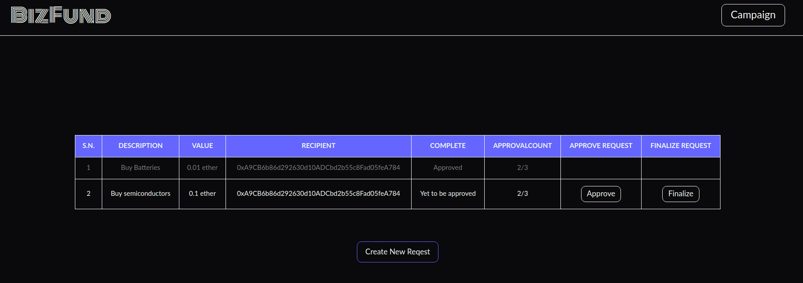

## BizFund

BizFund is a platform inspired by Kickstarter, where most of the features are same as that of Kickstarter. The main difference is that it uses smart contracts for creating campiagns and is completely decentralised. Anyone can contribute to any of the created campaigns. The person who creates the campaign can make requests for spending the ether in his campaign and only the backers of the campaign can raise the approval. The spending request can finalised only when the approval count is more than the half of the number of backers. Once approved and finalised, the ether would be sent directly to the recepient, thus eliminating the middleman.

Note: The smart contract is currently on rinkeby test network and you would need to install metamask extension for chrome to interact with the website. Plus you would also need some test ether which you can easily get at https://faucet.rinkeby.io/ .

#### Deployed: https://bizfund.netlify.app/

